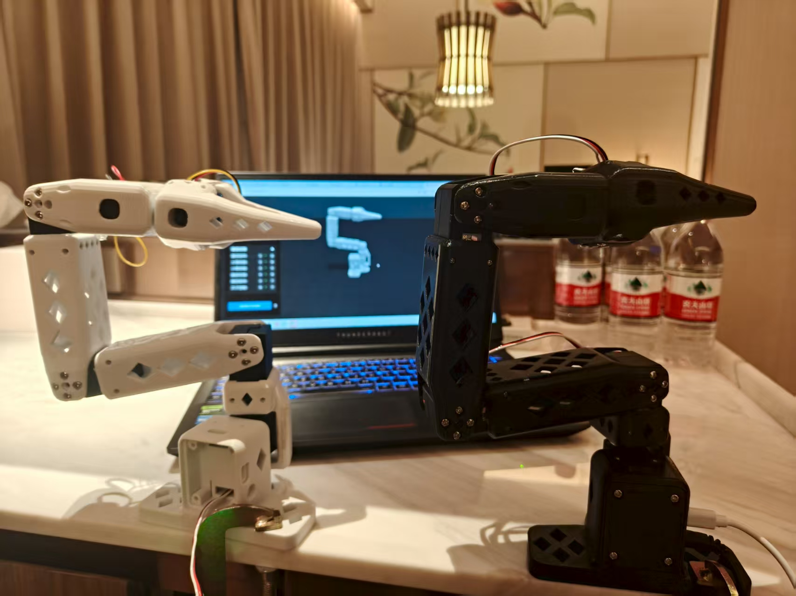
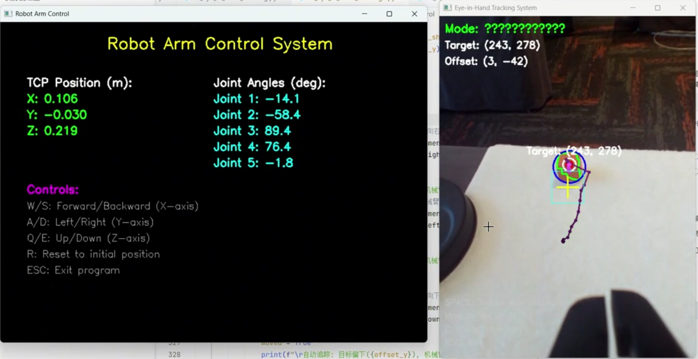
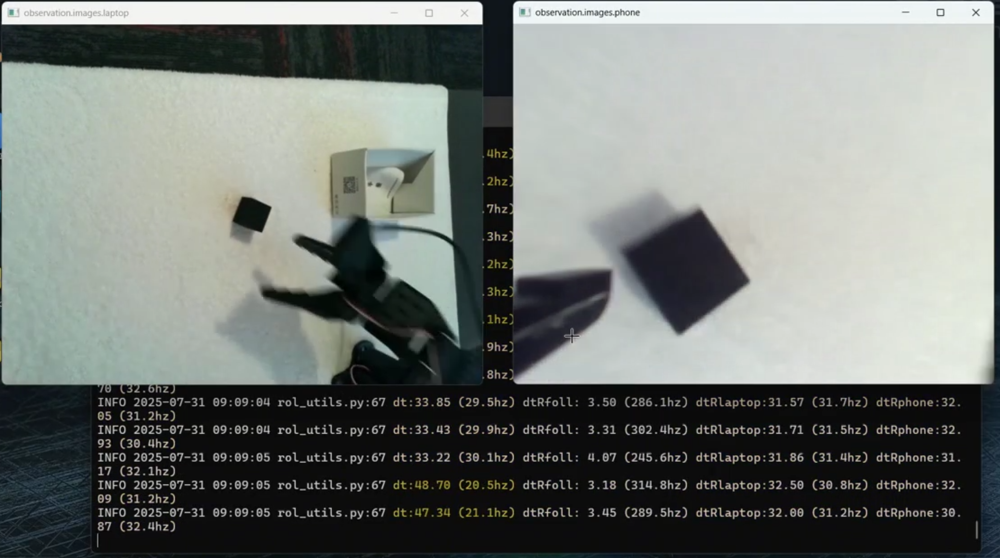
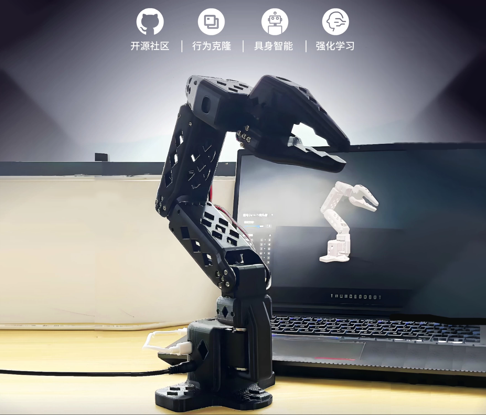

# McpArmRobot

> 基于MCP的桌⾯级具身智能机械臂

本项目开发了一个基于MCP的桌⾯级具身智能机械臂，通过自然语言控制机械臂完成复杂的抓取、放置等任务。
系统部署于NVIDIA Jetson边缘设备，利用Triton推理服务器对实时图像进行推理，实现精准的视觉场景解析，TensorRT提升推理速度。

- 创新点：系统基于MCP协议的框架，实现“语义->意图->动作->执行”的智能闭环。

  用户自然语言指令在Jetson上的MCP客户端被拆解、理解。融合语义意图与视觉信息，匹配预置接口，生成最优运动指令，利用MCP服务器驱动六轴机械臂精确执行任务。无缝融合语言理解与视觉感知，实现自主“眼手协调”。

- 实现功能：自然语言驱动的物体抓取、搬运、分类等桌面级复杂操作。

- 应用领域：教育机器人实验平台、工业自动化原型研究、智能家居物品整理及小型仓储分拣等场景。

## 手眼追踪

## 视觉抓放

## 同步仿真

